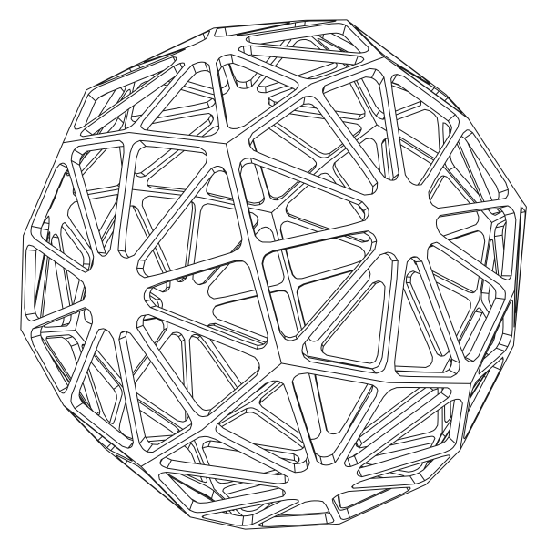
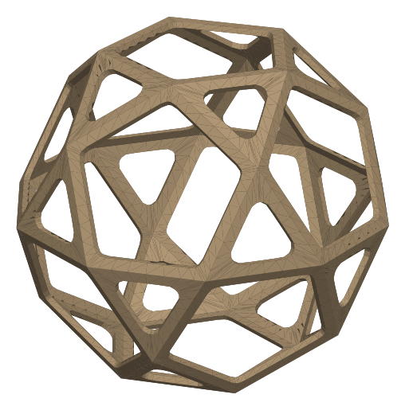
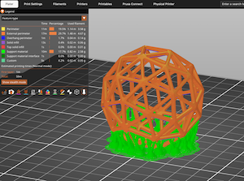

# Shapemaker

A browser app for designing geometric forms for physical fabrication and art.
Choose a base shape, scale and modify it with real millimetre dimensions, rest
it on a face, and export an STL for printing or an SVG line drawing.

**Live app:** [somebox.github.io/shapemaker](https://somebox.github.io/shapemaker/)


## Try it

Open the [live app](https://somebox.github.io/shapemaker/). No install is
required. On first visit, a short tip walks through the loop:

1. **Pick a start** — choose a built-in shape from the Start from row.
2. **Adjust** — tune Size, Form (hollow/solid, wall, border, fillet), and
   optional distort (jitter, truncate, spike, subdivide, smooth).
3. **Click a face** — set which side rests on the print bed.
4. **Export** — download STL for the slicer, or SVG for a clean outline.

Share a design with the **Share** control (copies a link that restores the
same settings). **Export** / **Load** under JSON Model File save and reopen
a `.shapemaker.json` project on your machine.

## Exports

| Hidden-line SVG | Oriented STL | In the slicer |
|---|---|---|
| [](media/example-export.svg) | [](media/example-export.stl) | [](media/prusa-slicer-screenshot.png) |

- **Export STL** — binary mesh in millimetres, already oriented to the resting
  face. Filenames include size (and seed / point count when those matter).
- **Export SVG** — camera-matched hidden-line drawing (silhouette and crease
  edges), editable in vector tools.

Optional **Print risk** and **Section** tools sit on the viewport: overhang /
flat-bridge overlays, and a height clip to inspect cavities.

## What you can change

| Area | Controls |
|---|---|
| Start | Platonic solids, icosidodecahedron, cuboctahedron, rhombicosidodecahedron, rhombic 12/30, globe, sphere, random hull; named star presets |
| Size | Overall diameter; Edge length on regular shapes |
| Form | Hollow or solid, open or closed faces, wall, border, fillet |
| Distort | Jitter (amount, direction, seed), truncate, spike, subdivide, smooth |
| Make | Resting face, mesh quality (Draft / Normal / Fine), material / mass estimate |

Quality densifies real triangles in both the preview and the STL — the view
stays flat-shaded so what you see is what you print.

## Run locally

The app is static files (no build step). Serve over HTTP — ES modules do not
load from `file://`:

```bash
# from the directory that contains shapemaker/
cd ..
python3 -m http.server 8000
# open http://localhost:8000/shapemaker/
```

Serving the repo root at `/` also works.

## License

MIT — see [`LICENSE`](LICENSE).

## Docs

| Doc | Audience |
|---|---|
| [`DEV.md`](DEV.md) | Developing, testing, CI, and project layout |
| [`docs/SPEC.md`](docs/SPEC.md) | Product behavior and architecture |
| [`docs/PROJECT_FORMAT.md`](docs/PROJECT_FORMAT.md) | `.shapemaker.json` files |
| [`docs/ROADMAP.md`](docs/ROADMAP.md) | Future ideas and backlog |
| [`docs/CHANGELOG.md`](docs/CHANGELOG.md) | Released versions |

Contributions welcome when they improve physical design, fabrication handoff,
or the experience of creating interesting forms. See [`DEV.md`](DEV.md).
